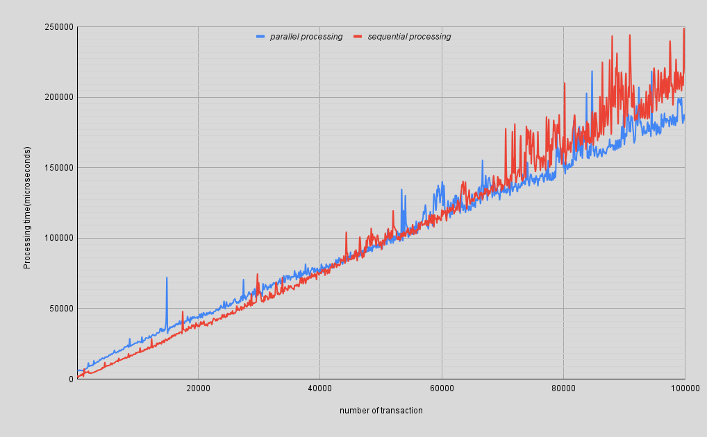

# MerkleTreeRoot

Merkle Tree root calculation in Elixir. `merkle_tree_root` calculates tree nodes (hashes) by concatenating nodes 
pair(hashes) from the previous layer and performs hashing(SHA256). If the number of nodes is odd, it copies the last 
node to calculate the next layer nodes.

## Features
* Merkle tree root calculation (sequential and parallel processing)
* Transactions preparation for the subsequent tree processing (file adapter)
* MerkleTreeRoot.Source behaviour allows implementing desired transactions source and formatting

## Installation

---
**[Preconditions]**
Installed elixir(1.12 or above)
---

### As a library
* Add `merkle_tree_root` to the list of dependencies in `mix.exs` as:
```elixir
def deps do
  [
    {:merkle_tree_root, git: "git@github.com:sergofun/merkle_tree_root.git", branch: "master"},
  ]
end
```
* Get all dependencies:
```bash
mix deps.get 
```
### As an application

* Clone repo:
```bash
git clone https://github.com/sergofun/merkle_tree_root.git  
cd merkle_tree_root
```
* Get all dependencies:
```bash
mix deps.get
```
* Compile application and run shell:
```bash
iex -S mix
```

## Usage
### Merkle tree root calculation
To calculate Merkle tree root use `MerkleTreeRoot.compute/2` function. 
It also supports `parallel` option. If `parallel` is set to `true` (default `false`) the tree root calculation uses 
gen_stages for the parallel processing. 

Example:
```elixir
iex> 1..100 |> Enum.map(&(Integer.to_string(&1))) |> MerkleTreeRoot.compute()
{:ok, "fc78057bc9045b6d2b4af35329c268ca827ac01c7d9384b84a61ab271cc3708a"}

iex> 1..100 |> Enum.map(&(Integer.to_string(&1))) |> MerkleTreeRoot.compute(parallel: true)
{:ok, "fc78057bc9045b6d2b4af35329c268ca827ac01c7d9384b84a61ab271cc3708a"}
```

### Transactions preparation
By default `merkle_tree_root` provides adapter (`MerkleTreeRoot.FileAdapter`) for the input file which has one 
hex_encoded transaction per line
Example:
```elixir
iex> MerkleTreeRoot.FileAdapter |> MerkleTreeRoot.txns("./priv/sample_8") |> MerkleTreeRoot.compute
{:ok, "bdd07e07772861b7c4e954674c2b012246249f4f4e9c0071d387d3077909c919"}
iex> MerkleTreeRoot.FileAdapter |> MerkleTreeRoot.txns("./priv/sample_1000") |> MerkleTreeRoot.compute(parallel: true)
{:ok, "ad079a53015f07e9ba30e9118eab6f673d1f70dad2d6dc8c9d84fe9f8d51c594"}
```
You can implement desired transactions provider just adopting `MerkleTreeRoot.Source` behaviour for your case.

### Testing
To run tests:
```bash
mix deps.get
mix test
```

## Performance
Depending on the amount of transactions you can use sequential or parallel processing. 

I measured dependence between number of transactions and tree root calculation time for both options:


As you can see, if amount of transactions is less than 50000, the sequential processing shows better results than parallel
processing, because the last one has to do nodes sorting and enumeration during each tree layer processing. On the other hand
parallel processing becomes more efficient in the case of large amounts of transactions. Therefore, I've decided to keep both.

---
**[NOTE]**
I also tried to figure out what could be improved from the performance point of view for the nodes calculation. I thought
that I could get rid of splitting nodes to the pair(as a separate operation) and list reverse operation
(by keeping list traverse direction), but after some measurements such approach hasn't shown any significant performance 
improvements and made code less readable, that's why I've decided to keep it as it is.
---

